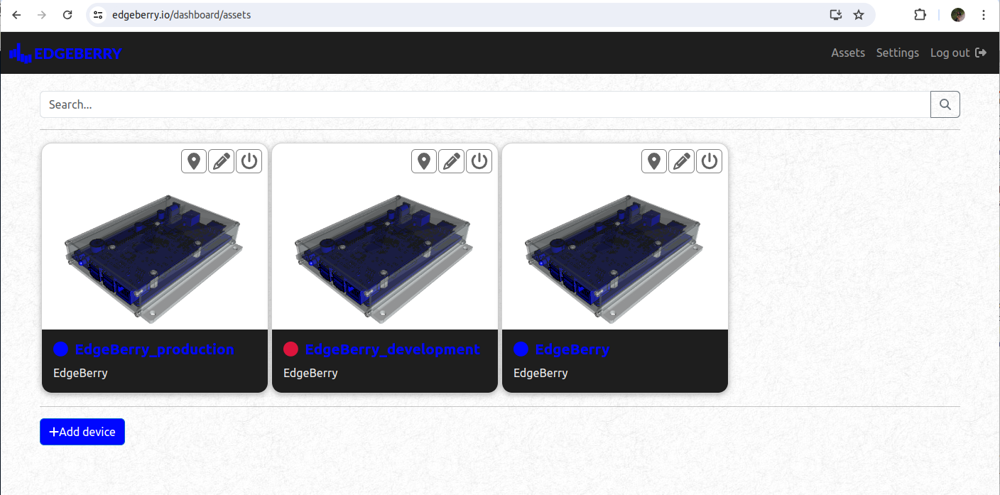

> **"One _Dashboard_ to rule them all, one _Dashboard_ to find them, one _Dashboard_ to _connect_ them all and _on the internet_ bind them"**

The Edgeberry Dashboard is an online asset management platform for [Edgeberry devices](https://github.com/SpuQ/Edgeberry). The official Edgeberry Dasboard is available on [Edgeberry.io](https://edgeberry.io/dashboard).



## AWS IoT Core
### Device Registry
The device registry is a centralized database that stores information about the IoT devices. It keeps track of device details like connectivity status, device attributes, ...

Fleet indexing is enabled to organize and search for IoT devices efficiently. It creates a searchable index of your devices based on their attributes. This makes it easier to find and manage devices at scale.

```
TODO Edgeberry registry info
```
### Provisioning
Provisioning is the automated process of setting up and configuring devices and related services so they are ready for operation.
```
AWS IoT > Connect many devices
```
#### Provisioning template (with claim certificates)
The provisioning template is a setup blueprint for adding new devices to your IoT system automatically. It includes all the necessary details, like certificates and policies, to get the devices up and running quickly.
```
AWS IoT > Connect many devices > Create provisioning template > with claim certificates
```

```
TODO: Edgeberry provisioning template
```

##### Device policy
An AWS IoT Core device policy is a (JSON) document that defines the permissions for a device interacting with AWS IoT Core. These policies specify what actions a device is allowed to preform and on which resources within the AWS IoT environment. This policy ensures a device operates within defined security constrains and can only access necessary resources.

```
TODO: Edgeberry device policy
```

##### Security
Assuming the provisioning certificate and key will become widely known really fast, we'll check the UUID of the device by defining a trigger for a Lambda function to check the provided UUID against a list of known devices (stored in DynamoDB). Additionally, we'll limit the amount of request a device can make within a time window to prevent brute-force guessing of valid UUIDs.
```
TODO: lambda function
```

#### Registration credentials
TODO: info about the provisioning certificate and private key, etc.

### Thing type
```AWS IoT > Manage > Thing types```
The thing type in AWS IoT Core is a blueprint for similar groups of IoT devices. It defines the common characteristics, attributes and configurations shared among multiple devices of the same type.

```
Thing type
Thing type name: Edgeberry
Description:
The Edgeberry devices

Searchable attributes:
deviceOwner         // the ID of the device owner
deviceName          // the given name to the device
deviceGroup         // the group to which the device belongs
```
## DynamoDB
info about setting up dynamo

## Elastic Beanstalk
Setting up Elastic Beanstalk for running the Edgeberry Dashboard application.

### Create NodeJS environment
Edgeberry Dashboard is written for NodeJS. Create an Elastic Beanstalk environment for NodeJS. \
https://docs.aws.amazon.com/elasticbeanstalk/latest/dg/create_deploy_nodejs.html

### Environment Variables
Set up the required environment variables for running the Edgeberry Dashboard. Navigate to your environment ```Elastic Beanstalk > Environment: Edgeberry-dashboard > Configuration > Environment Properties``` and add following properties:

| Key                           | Value                                    |
|-------------------------------|------------------------------------------|
| PORT                          | 8081                                     |
| JWT_SECRET                    | \<JSON Web token secret\>                  |
| AWS_IOT_PROVISIONING_KEY      | \<Key for provisioning claim certificate\> |
| AWS_IOT_PROVISIONING_CERT_ID  | \<Provisioning certificate ID\>            |

## Developer info
AWS setup for development:
- Create development User in AWS IAM
- Set User permissions (with policies)
- Create access key for development
- use development keyname and key in the development environment

## License & Collaboration
**Copyright© 2024 Sanne 'SpuQ' Santens**. The Edgeberry Dashboard project is licensed under the **[GNU GPLv3](LICENSE.txt)**.

### Collaboration

If you'd like to contribute to this project, please follow these guidelines:
1. Fork the repository and create your branch from `main`.
2. Make your changes and ensure they adhere to the project's coding style and conventions.
3. Test your changes thoroughly.
4. Ensure your commits are descriptive and well-documented.
5. Open a pull request, describing the changes you've made and the problem or feature they address.